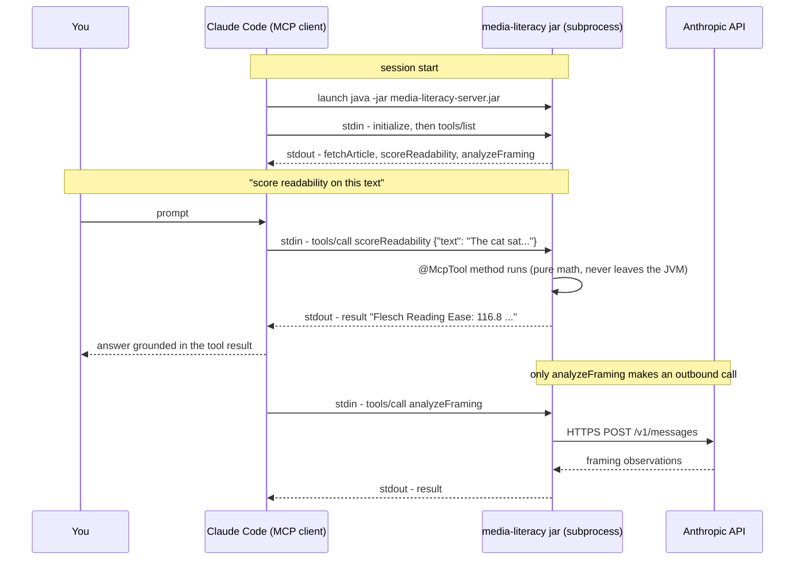

# Media Literacy MCP Server

An [MCP](https://modelcontextprotocol.io) server that gives an AI assistant a set of *lenses* for examining how a piece of text is constructed — how hard it is to read, how it is framed, what language it leans on. It deliberately never judges whether content is **true**; it makes the construction visible and leaves the judgment with the reader.

Built with Spring Boot and Spring AI's MCP server support, speaking JSON-RPC over stdio.

## Tools

| Tool | Type | What it does |
|------|------|--------------|
| `fetchArticle` | Deterministic | Fetches a URL and extracts readable article text (jsoup), stripped of scripts, navigation, and boilerplate. |
| `scoreReadability` | Deterministic | Scores text with the Flesch Reading Ease and Flesch–Kincaid Grade Level formulas — pure text statistics, no external calls. |
| `analyzeFraming` | LLM-backed | Asks Claude (via the Anthropic API) to point out framing patterns: loaded language, one-sided phrasing, emotionally charged wording. Explicitly instructed not to rule on truth. |

The tools are independent classes with no references to each other. Composition happens in the MCP client: given a URL, the assistant chains `fetchArticle` → `scoreReadability` → `analyzeFraming` on its own.

## Why readability formulas?

Flesch Reading Ease (1948) and Flesch–Kincaid Grade Level (1975) are regression models from reading research: two cheap-to-measure predictors — words per sentence (syntactic load) and syllables per word (vocabulary difficulty) — fitted against tested reader comprehension. Knowing that an article is pitched at a 5th-grade reading level versus a postgraduate one says something real about who it is written for and how it works on its audience. It is the deterministic counterweight to the LLM lens: cheap, reproducible, and unit-testable.

## Requirements

- Java 17+
- An [Anthropic API key](https://console.anthropic.com/) (only needed for `analyzeFraming`; the other tools work without one)

## Build

```bash
./gradlew build
```

This runs the tests and produces `build/libs/media-literacy-server-0.0.1-SNAPSHOT.jar`.

## Register with Claude Code

The server uses the stdio transport: the client launches the jar as a subprocess and talks JSON-RPC over stdin/stdout (which is why `application.yml` silences all console output — stdout carries the protocol).

```bash
claude mcp add media-literacy \
  --env ANTHROPIC_API_KEY=sk-ant-... \
  -- java -jar /absolute/path/to/build/libs/media-literacy-server-0.0.1-SNAPSHOT.jar
```

Then in a Claude Code session, `/mcp` shows the connection and its tool list. Try:

> fetch https://en.wikipedia.org/wiki/Media_literacy and score its readability

After changing the code, run `./gradlew build` again and reconnect — the client runs the jar, not your sources.

## How a tool call flows

There is no port and no inbound HTTP: Claude Code launches the jar as a subprocess and the two talk JSON-RPC over the subprocess's stdin/stdout. Spring AI routes each incoming `tools/call` to the matching `@McpTool` method, the same way Spring MVC routes an HTTP request to a `@GetMapping` method.



Anything else printed to stdout would land in the middle of that JSON stream and corrupt it — which is why `application.yml` disables the banner and console logging, and why debug output in this project must go to the log file, never `System.out`.

## Tests

```bash
./gradlew test
```

Deterministic tools are tested against hand-verified ground truth (known sentence/word/syllable counts and formula results). The LLM-backed tool is tested with a mocked `HttpClient` — no network, no API key.

## Project layout

```
src/main/java/.../MediaLiteracyServerApplication.java   Spring Boot entry point
src/main/java/.../ArticleFetchTool.java                 fetchArticle
src/main/java/.../ReadabilityScoreTool.java             scoreReadability
src/main/java/.../FramingAnalysisTool.java              analyzeFraming
src/main/java/.../HttpClientConfig.java                 shared HttpClient bean
src/main/resources/application.yml                      stdio-safe logging + MCP server config
```

## Roadmap

- A deterministic loaded-language counter backed by a lexicon
- An `@McpPrompt` guided "analyze this article" workflow and an MCP resource exposing the lexicon
- Hardening `fetchArticle` (response size limits, content-type checks)
- Switching to the WebMVC transport and deploying remotely over HTTP

## Status

A learning project for building MCP servers in Java — APIs and tool behavior may change freely.
